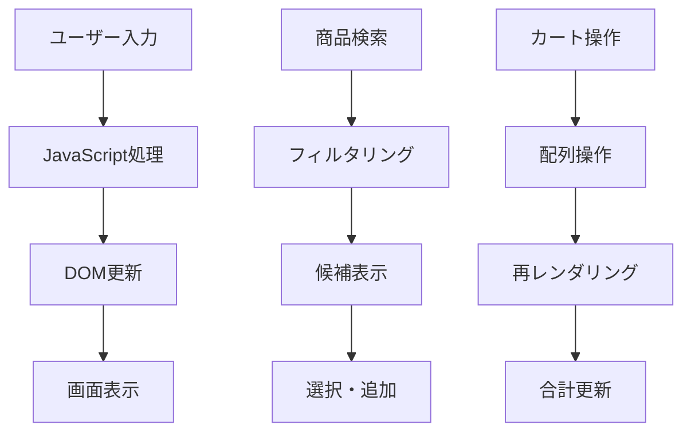

# システムインフラストラクチャ仕様書

## 1. システム概要

本システムは軽量で高速なWebベースのPOSシステムであり、シンプルなフロントエンド技術スタックを使用してモバイルファーストの設計で開発されています。

## 2. 技術スタック

### 2.1 フロントエンド技術

| 技術 | バージョン | 用途 | 説明 |
|------|------------|------|------|
| **HTML5** | Latest | マークアップ | セマンティックHTML構造、レスポンシブデザイン対応 |
| **Tailwind CSS** | v2.2.19 | スタイリング | ユーティリティファーストCSSフレームワーク |
| **JavaScript (ES6+)** | Native | ロジック実装 | モダンなES6クラス・モジュール構成、イベント処理 |
| **JavaScript (ES6+)** | Native | ロジック実装 | モダンJavaScript構文でビジネスロジック実装 |

### 2.2 データ管理

```javascript
// src/data/products.js
export class ProductManager {
  constructor() {
    this.products = [
      { name: 'りんご', code: 'A001', price: 120, barcode: '123456', desc: '新鮮なりんご' },
      { name: 'バナナ', code: 'A002', price: 80, barcode: '234567', desc: '甘いバナナ' }
    ];
  }
  search(query) { /* ... */ }
}

// src/scripts/cart.js
export class CartManager {
  constructor() {
    this.cart = [];
    this.total = 0;
  }
  addItem(item) { /* ... */ }
  removeItem(index) { /* ... */ }
  updateQuantity(index, qty) { /* ... */ }
}

// src/scripts/utils.js
export const formatPrice = (price) => `¥${price.toLocaleString()}`;
export const validateInput = (input) => { /* ... */ };
```

### 2.3 ビルドツール・開発環境

| ツール | 用途 | 説明 |
|--------|------|------|
| **Live Server** | 開発サーバー | ホットリロード対応 |
| **Webpack** | バンドラー | モジュール管理・最適化 |
| **ESLint** | コード品質 | JavaScript構文チェック |
| **Prettier** | フォーマット | コード整形 |

## 3. アーキテクチャ設計

### 3.1 ファイル構成

```
project/
├── index.html                   # メインエントリーポイント
├── src/
│   ├── app/                     # アプリケーション（SPA/画面単位）
│   ├── components/              # 再利用可能なコンポーネント
│   │   ├── header.html
│   │   ├── footer.html
│   │   └── modal.html
│   ├── styles/
│   │   ├── main.css             # カスタムCSS
│   │   ├── components.css       # コンポーネント用CSS
│   │   └── utilities.css        # ユーティリティCSS
│   ├── scripts/
│   │   ├── main.js              # アプリエントリーポイント（POSAppクラス）
│   │   ├── cart.js              # カート管理（CartManagerクラス）
│   │   └── utils.js             # ユーティリティ関数
│   └── data/
│       └── products.js          # 商品データ管理（ProductManagerクラス）
├── assets/
│   ├── images/                  # 画像ファイル
│   │   ├── icons/
│   │   └── logos/
│   ├── fonts/                   # フォントファイル
│   └── media/                   # その他メディア
├── docs/
│   ├── 00_intructions/          # 開発指示書
│   ├── 01_templates/            # テンプレート
│   ├── 02_user-stories/         # ユーザーストーリー
│   ├── 03_画面系/               # 画面仕様
│   ├── 04_機能系/               # 機能仕様
│   └── 05_DM系/                 # データモデル
├── tests/                       # テストファイル
│   ├── unit/
│   ├── integration/
│   └── e2e/
├── config/                      # 設定ファイル
│   ├── webpack.config.js
│   ├── eslint.config.js
│   └── tailwind.config.js
└── dist/                        # ビルド出力（本番用）
    ├── css/
    ├── js/
    └── images/
```

### 3.2 コンポーネント設計

#### 3.2.1 フォルダ別構成
- **src/app/**: メインアプリケーション
- **src/components/**: 再利用可能なUIコンポーネント
- **src/styles/**: CSS組織化（BEM記法推奨）
- **src/scripts/**: JavaScript機能別分割
- **src/data/**: データ管理・モック
- **assets/**: 静的リソース管理

#### 3.2.2 検索・追加機能
- **検索入力**: リアルタイム商品検索（ProductManagerクラス）
- **バーコードスキャン**: デモ機能（拡張可能）
- **商品追加**: ワンクリック追加機能

#### 3.2.3 カート管理
- **商品リスト**: 動的なカート表示（CartManagerクラス）
- **数量調整**: +/-ボタンでの数量変更
- **削除機能**: 個別商品削除

#### 3.2.4 決済機能
- **支払い方法選択**: モーダルベースUI
- **合計計算**: CartManagerによるリアルタイム計算
- **ポイント計算**: 1%還元システム

## 4. データフロー



## 5. 技術的特徴

### 5.1 レスポンシブデザイン
- **モバイルファースト**: 最大幅400pxで最適化
- **Tailwind CSS**: ユーティリティクラスによる高速開発
- **フレックスボックス**: 柔軟なレイアウト設計
- **クラスベースJS**: ES6クラス・モジュールで保守性向上

### 5.2 パフォーマンス最適化
- **軽量実装**: 外部依存関係最小化（jQuery非依存）
- **メモリ効率**: シンプルなデータ構造
- **高速レンダリング**: 効率的なDOM操作

### 5.3 ユーザビリティ
- **直感的UI**: アップル風デザイン採用
- **タッチ最適化**: モバイルデバイス対応
- **アクセシビリティ**: キーボードナビゲーション対応
- **ES6モジュール**: import/exportによる明確な依存管理

## 6. セキュリティ考慮事項

### 6.1 フロントエンドセキュリティ
- **XSS対策**: 適切なエスケープ処理
- **データバリデーション**: 入力値検証（utils.jsで実装）
- **CSP**: Content Security Policy実装推奨

### 6.2 データ保護
- **ローカルストレージ**: 機密データは保存しない
- **セッション管理**: 適切なタイムアウト設定
- **HTTPS**: 本番環境での必須要件

## 7. 拡張性

### 7.1 バックエンド統合準備
```javascript
// API統合例
async function fetchProducts(query) {
  try {
    const response = await fetch(`/api/products?q=${query}`);
    return await response.json();
  } catch (error) {
    console.error('Product fetch error:', error);
    return sampleItems; // フォールバック
  }
}
```

### 7.2 機能拡張ポイント
- **リアルタイム在庫**: WebSocket統合
- **オフライン対応**: Service Worker実装
- **多言語対応**: i18n国際化
- **テーマ切り替え**: CSS変数活用

## 8. デプロイメント

### 8.1 開発環境
- **ローカルサーバー**: Live Server等の使用推奨
- **ホットリロード**: 開発効率向上
- **デバッグ**: ブラウザ開発者ツール活用

### 8.2 本番環境
- **CDN配信**: Tailwind CSS等の外部リソース
- **圧縮**: HTML/CSS/JS最適化
- **キャッシュ**: 適切なキャッシュ戦略


## 9. メンテナンス


### 9.1 コード品質・ユニットテスト
- **ESLint**: JavaScript標準化
- **Prettier**: コードフォーマット
- **命名規則**: 日本語ビジネス用語との整合性
- **ES6クラス/モジュール**: 保守性・拡張性重視
- **ユニットテスト（UT）**: 主要なクラス・モジュール（例：CartManager, ProductManager, utils等）はJest等のテストフレームワークで単体テストを実施。テストコードは `tests/unit/` 配下に配置。

#### UT例（Jest）
```js
// tests/unit/cart.test.js
import { CartManager } from '../../src/scripts/cart.js';
test('addItemでカートに商品が追加される', () => {
  const cart = new CartManager();
  cart.addItem({ name: 'りんご', price: 120 });
  expect(cart.cart.length).toBe(1);
});
```

### 9.2 監視・ログ
- **エラーハンドリング**: 適切な例外処理
- **パフォーマンス監視**: Core Web Vitals測定
- **ユーザー行動**: アナリティクス統合

## 10. 今後の展望

- **PWA化**: Progressive Web App対応
- **AI統合**: 商品推薦機能
- **IoT連携**: ハードウェア統合
- **クラウド移行**: スケーラブルアーキテクチャ

---

*最終更新: 2025年11月5日*