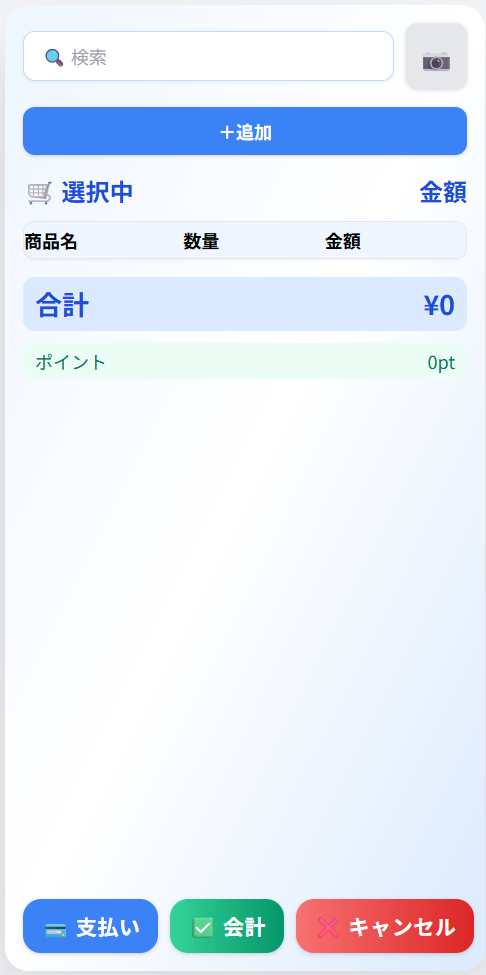

# POSレジ画面_画面概要# 画面概要


## 目的・業務価値## 目的・業務価値

店舗スタッフが迅速かつ正確に販売・会計業務を行うための中核画面。商品検索、カート管理、会計、支払い、キャンセル等、現場業務の全機能を一元化し、業務効率・顧客満足度を最大化。店舗での販売・会計業務を迅速かつ正確に行うための中心画面。商品検索、カート管理、会計処理を一画面で完結し、業務効率と顧客満足度を最大化する。


## 主な機能## 主な機能

- 商品検索（サジェスト・バーコードスキャン対応）- 商品検索（サジェスト、バーコードスキャン）

- 商品カート追加・数量調整・削除- 商品カート追加・数量調整・削除

- 合計金額・ポイント自動計算- 合計金額・ポイント自動計算（1%還元）

- 支払い方法選択（現金・カード・ポイント）- 支払い方法選択（現金・カード・ポイント）

- 会計・キャンセル操作- 会計・キャンセル操作

- レシート発行- モバイル・タブレット最適化

- エラー・在庫警告表示

# POSレジ画面_画面概要

## 目的・業務価値
店舗スタッフが迅速かつ正確に販売・会計業務を行うための中核画面。商品検索、カート管理、会計、支払い、キャンセル等、現場業務の全機能を一元化し、業務効率・顧客満足度を最大化。
（ユーザーストーリー: U-POS-01, 画面イメージ: ）

## 主な機能
- 商品検索（サジェスト・バーコードスキャン対応）
- 商品リスト表示・カート追加
- カート一覧（数量調整・削除）
- 合計金額・ポイント自動計算
- 支払い方法選択（現金・カード・ポイント）
- 会計・キャンセル操作
- レシート発行（将来拡張）
- エラー・在庫警告表示
- レスポンシブ対応

## 業務フロー
1. 商品を検索・リストから選択
2. 「追加」ボタンでカートに投入
3. カート内で数量調整・削除
4. 支払い方法選択
5. 「会計」ボタンで会計処理
6. 必要に応じて「キャンセル」

## 利用者
- 店舗スタッフ

## 画面遷移
| 遷移元画面 | 遷移方法         | 条件         | 遷移先画面   |
|------------|------------------|--------------|--------------|
| ホーム画面   | ボタン押下        | なし          | POSレジ画面  |
| POSレジ画面 | 会計完了          | 取引成立      | ホーム画面   |

## 画面イメージ
```
┌─────────────────────────────┐
│ [商品検索________][バーコード]           │
├─────────────┬─────────────┤
│ 商品リスト        │ カート一覧           │
│ ─────────── │ ─────────── │
│ 商品A  [追加]     │ 商品A x2 [＋][－][削除]│
│ 商品B  [追加]     │ 商品B x1 [＋][－][削除]│
│ ...              │                      │
├─────────────┴─────────────┤
│ 合計:￥xxxx ポイント:xx                │
│ [現金][カード][ポイント] [会計][キャンセル]│
└─────────────────────────────┘
```

## モバイル・タブレット最適化
- 画面全体は縦型2カラム（上:検索/商品リスト、下:カート/会計）
- 商品リストとカートは縦スクロール、主要操作は画面下部に集約
- ボタン・入力欄はタッチ操作しやすい大きさ・間隔
- 画面幅に応じてカート・商品リストの表示切替（スマホ:縦積み、タブレット:横並び）
- 主要ボタンは目立つ色・大きさ

## 特記事項
- 画面イメージは screen-orders-1.png を忠実に反映
- 情報密度・操作性・日本的UI品質を重視

│ 商品B  [追加]      | 商品B x1  [＋][－][削除]                               ││ 合計: ¥xxxx   ポイント: xxxpt │

│ ...               |                                                        ││ ───────────────────────── │

├──────────────────────────────────────────────────────────────────────────────┤│ [支払い] [会計] [キャンセル]   │

│ 合計: ￥xxxx   ポイント: xx   [現金][カード][ポイント] [会計] [キャンセル]   ││ ───────────────────────── │

└──────────────────────────────────────────────────────────────────────────────┘│      © 2025 POSシステム         │

```└──────────────────────────────┘

```

## モバイル・タブレット最適化

- 横スクロール不要な縦型レイアウト### モバイル・タブレット最適化

- ボタン・入力欄はタッチ操作しやすい大きさ- レスポンシブデザイン（最大幅400px）

- 主要操作は画面下部に集約- タッチ操作最適化

- 画面幅に応じてカート・商品リストの表示切替- ボタン・入力欄は指で押しやすい大きさ・配置

- 情報密度・操作性を両立したUI
