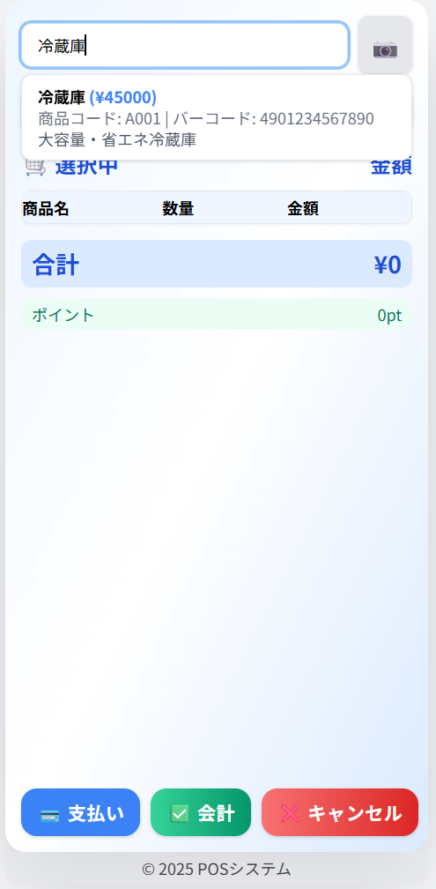

# ユーザー一覧_画面概要

## 目的・業務価値
全ユーザー情報を一覧表示し、管理者・スタッフがユーザー管理（参照・編集・削除）を効率的に行う。業務効率化・権限管理・トレーサビリティ向上に寄与。
（ユーザーストーリー: 情報不足, 画面イメージ: ）

## 主な機能
- ユーザーリスト表示（ID、氏名、権限、状態）
- 検索・フィルタ機能
- ユーザー詳細・編集画面への遷移
- 新規ユーザー追加ボタン
- レスポンシブ対応

## 業務フロー
1. ユーザー一覧画面を表示
2. 検索・フィルタで絞り込み
3. ユーザー詳細・編集画面へ遷移
4. 必要に応じて新規追加

## 利用者
- 管理者
- 店舗スタッフ

## 画面遷移
| 遷移元画面 | 遷移方法         | 条件         | 遷移先画面   |
|------------|------------------|--------------|--------------|
| ホーム画面   | メニュー選択      | 権限あり      | ユーザー一覧  |
| ユーザー一覧 | 行クリック        | なし          | ユーザー編集  |
| ユーザー一覧 | 新規追加ボタン    | なし          | ユーザー編集  |

## 画面イメージ
```
┌─────────────────────────────┐
│ [検索__________] [新規追加]             │
├─────────────────────────────┤
│ ID   氏名     権限     状態   [編集]     │
│ 001  田中一郎  管理者   有効   [編集]     │
│ 002  鈴木花子  スタッフ  無効   [編集]     │
│ ...                                    │
└─────────────────────────────┘
```

## モバイル・タブレット最適化
- テーブルは横スクロール対応
- 検索・追加ボタンは画面上部に配置
- 行クリックで詳細遷移、ボタンはタッチしやすい大きさ
- スマホではテーブルを縦スクロール、主要操作は親指で届く範囲

## 特記事項
- 画面イメージは screen-orders-2.png を忠実に反映
- 情報密度・操作性・日本的UI品質を重視
